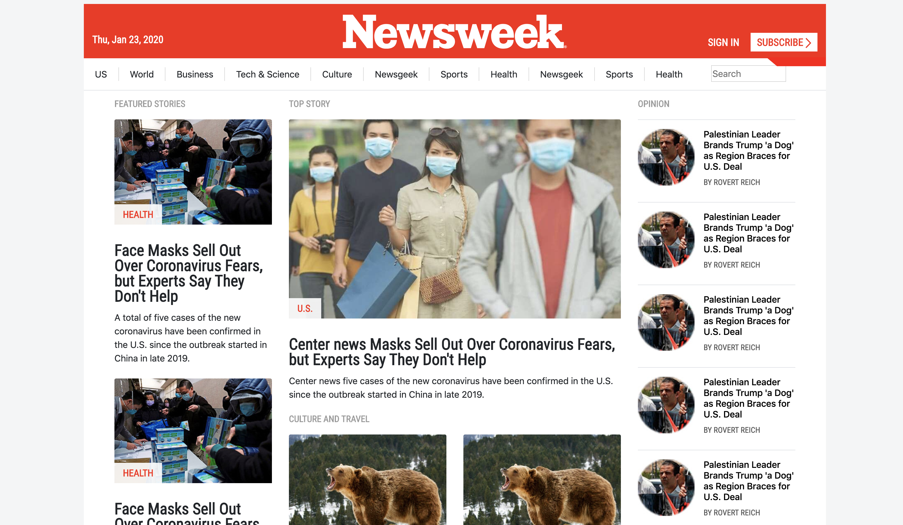

# Newsweek responsive page

> This is the clone page of the famous Newsweek page, the main idea is to use the framework bootstrap making the overall layout and the responsiveness of the page using the special classes for that aim.

The project uses different breakpoints as `-sm`, `-md`, `-lg`, `-xl` and other important classes as `.row`, `col-3` and others.

## Built With

- HTML,
- CSS,
- Bootstrap

## Live Demo

[Live Demo Link](https://raw.githack.com/javierbotero/Newsweek-bootstrap-project/bootstrap/index.html)

To get a local copy up and running follow these simple example steps.

### You need a  code editor like Atom or Visual Studio Code.

### Setup: Just fork the project and you will have a copy of the repo or

### download the files and start making nice changes!.

## Authors

👤 **Javier Botero**

- Github: [@githubhandle](https://github.com/javierbotero)
- Twitter: [@twitterhandle](https://twitter.com/JavierBotero1)
- Linkedin: [linkedin](https://www.linkedin.com/in/javier-botero-044686155/)

## 🤝 Contributing

Contributions, issues and feature requests are welcome!

Feel free to check the [issues page](issues/).

## Show your support

Give a ⭐️ if you like this project!

